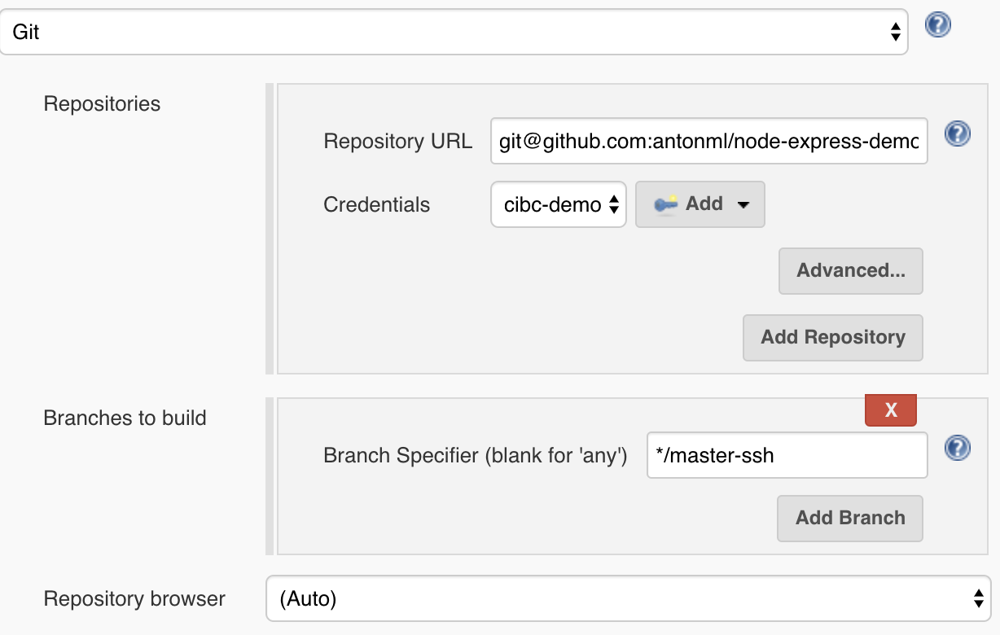
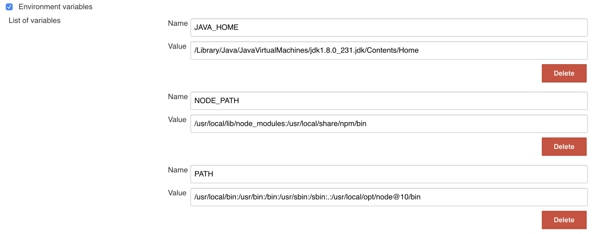
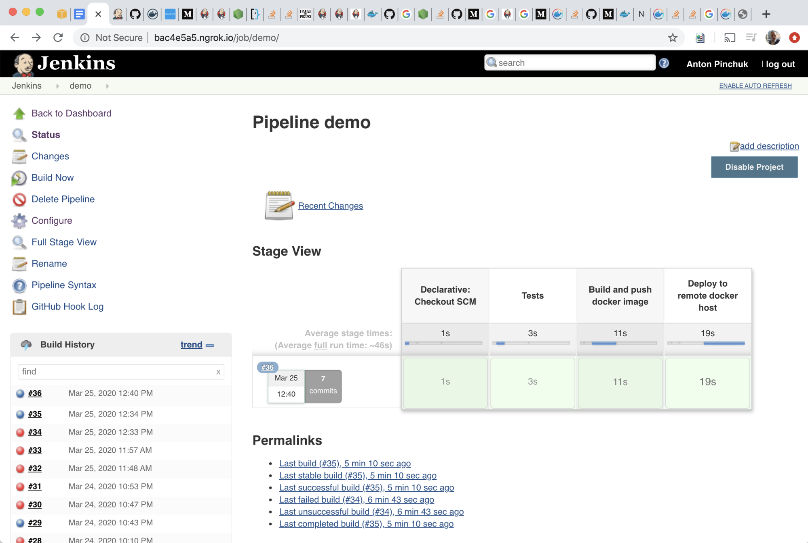
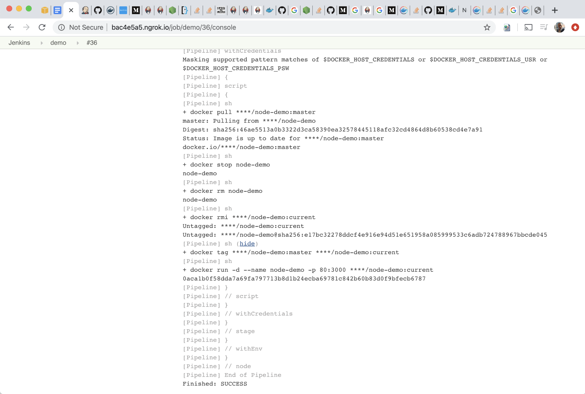
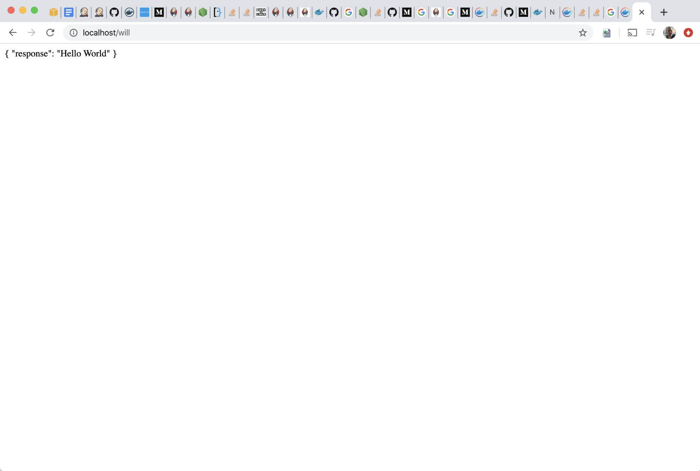

# CI/CD NodeJS, Jenkins and Docker Setup Tutorial

## Overview
Below stuff took me 2 days to complete, just because I was new to Jenkins and stuck with a couple of basic configuration things. 

This tutorial is tight, requires understanding of DevOps fundamentals, plz refer to corresponding documentation for more details.

Hope it will save your time. 

## Challenge
This tech challenge is composed of three parts: development, container creation and CI/CD.
* First, we create a very basic server application using Node.js and wrap into Docker container
* As a second step, install and configure Jenkins
* Third, create a CI/CD pipeline with Jenkins to build, run tests and push image to Docker registry
* Lastly, to complete deployment, call host docker API to pull image from registry

## Jenkins

I installed it on MacOS using [homebrew](http://brew.sh). _I also played with running it as docker container. A challenge part here is that our pipeline will require executing docker build, that cause docker in docker, which is possible, but tricky (see below)._ 

In real life you most likely run Jenkins on VPS or private server with Ubuntu/Debian where configuration is pretty similar to what I've done here.  

Because I need github to access my local jenkins from outside I set up [ngrok](https://ngrok.com/), which is pretty easy, installed it with homebrew as well.

Run & configure Jenkins (Wizard), uncheck unnecessary plugins (like gradle) and add required ones:
* Git
* Credentials
* NodeJS
* Pipeline

Generate and setup git ssh credentials, so your machine able to access the repo:

Setup webhook on github to call your jenkins endpoint

#### Configure PATH's 
Use Jenkins global environment settings (e.g. to enable npm, docker etc). Put here everything that you need to run SSH commands in your pipeline (if it does not work from the box).

But this was not enough. Jenkins plugins, like [docker](https://plugins.jenkins.io/docker-plugin/), do execute system commands right from Java runtime and do not use Jenkins agents / global settings! So to make it work extra PATH configuration of Jenkins runtime was needed in my case. On MacOS there is .plist config I amended:
~~~
    <key>EnvironmentVariables</key>
    <dict>
      <key>PATH</key>
      <string>/usr/local/bin:/usr/bin:/bin:/usr/sbin:/sbin</string>
    </dict>
~~~ 

## Jenkins job

Create pipeline job.

Check “hook trigger for Scm”, add repository url (with ssh credentials) and “master” branch to trigger.

Create [Jenkinsfile](https://github.com/antonpinchuk/node-jenkins-demo/blob/master/Jenkinsfile) pipeline with build/tests stage:
~~~
            steps {
                echo 'Building..'
                sh 'npm install'
                echo 'Testing..'
                sh 'npm test'
            }
~~~

Use node docker image agent for build and tests:
~~~
            agent {
                docker {
                    image 'node:10-stretch'
                }
            }
~~~
or you can run your script inside docker container:
~~~
                script {
                   docker.image('node:10-stretch').inside { c ->
                        echo 'Building..'
                        sh 'npm install'
                        echo 'Testing..'
                        sh 'npm test'
                        sh "docker logs ${c.id}"
                   }
                }
~~~

## Build Docker image

Create [Dockerfile](https://github.com/antonpinchuk/node-jenkins-demo/blob/master/Dockerfile) for node image.

Add build stage to your pipeline:
~~~
            steps {
                echo 'Deploying....'
                node {
                    def customImage = docker.build("antonml/node-demo:master")
                }
            }
~~~

## Push docker image
Create Jenkins credentials for your docker hub registry, with type username/password, where id is `docker-demo`.

Add build stage:
~~~
                    docker.withRegistry('', 'demo-docker') {
                        dockerImage.push('master')
                    }
~~~

## Pull and run image on target docker host

Create another user/password credentials for remote docker, `demo-docker-host`.

Add build stage:
~~~
        stage('Deploy to remote docker host') {
            environment {
                CREDENTIALS = credentials('demo-docke-hostr')
            }
            steps {
                script {
                    sh 'docker login -u $CREDENTIALS_USR -p $CREDENTIALS_PSW 127.0.0.1:2375'
                    sh 'docker pull antonml/node-demo:master'
                    sh 'docker stop node-demo'
                    sh 'docker rm node-demo'
                    sh 'docker rmi antonml/node-demo:current'
                    sh 'docker tag antonml/node-demo:master antonml/node-demo:current'
                    sh 'docker run -d --name node-demo -p 80:3000 antonml/node-demo:current'
                }
            }
        }
~~~

Connecting to remote docker host (in my case docker host on my local machine). I used pure docker commands, because Docker plugin’s functionality is limited to implement this. If I have more time I would try [docker-build-step](https://plugins.jenkins.io/docker-build-step/).

This solution is not typical for production systems. In the real world in large projects images are being delivered to kubernetes, docker swarm, elastic beanstalk or other cloud platforms like digitalocean or heroku. For smaller projects hosted by VPS you may not needed docker, just upload application artifacts directly via SSH (see article below).

## Build screenshots

Run deployed project from container
 

## Technical issues (stoppers)

#### Install Jenkins in a docker container

This tech challenge is supposed to wrap a node app in docker image. I need NPM and Docker working on my Jenkins. There are 3 ways to get it working in docker container. 
- Bind and use the tool from host machine (I get error checking docker license)
- Install the tool separately inside the container (some people do it, some do not recommend)
- Run the tool (node) in docker image as agent, I need docker working for this
[Discussion thread](https://forums.docker.com/t/docker-not-found-in-jenkins-pipeline/31683/16)

I tried to use both blueocean image from docker.io and lts image from github
~~~
docker network
docker volume create jenkins-docker-certs
docker volume create jenkins-data
docker container run \
                   --name jenkins \
                   --rm \
                   --detach \
                   --network jenkins \
                   --env DOCKER_HOST=tcp://docker:2376 \
                   --env DOCKER_CERT_PATH=/certs/client \
                   --env DOCKER_TLS_VERIFY=1 \
                   --publish 88:8080 \
                   --publish 50000:50000 \
                   --volume jenkins-home:/var/jenkins_home \
                   --volume jenkins-docker-certs:/certs/client:ro \
                   jenkins/jenkins:lts
~~~
Useful options (trying to run host docker inside docker container)
~~~
                   --volume $(which docker):/usr/bin/docker \
                   --volume /var/run/docker.sock:/var/run/docker.sock \
                   --volume "$HOME":/home \
~~~

## Resources
*   [Alternative way - deploy artifact to target VPS/container via SSH](https://medium.com/@mosheezderman/how-to-set-up-ci-cd-pipeline-for-a-node-js-app-with-jenkins-c51581cc783c)
*   [Pipeline+Docker - optimize build, run in container, cache dependencies](https://jenkins.io/doc/book/pipeline/docker/)
*   [Wrap node in docker container](https://nodejs.org/en/docs/guides/nodejs-docker-webapp/)
*   [Docker Swarm on local VirtualBox](https://docs.docker.com/swarm/install-w-machine/)
